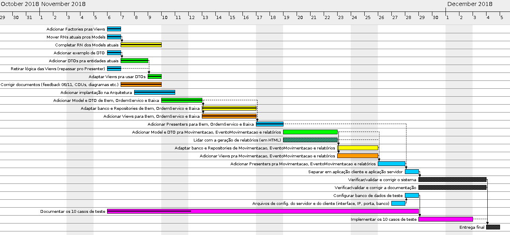

# InvSCP

Projeto InvSCP do Grupo 3 da disciplina "Integração 1" de Engenharia de Software, 2018/2

## Grupo

Este repositório pertence ao Grupo 3 (G3), composto pelos seguintes membros:

- João Pedro Arruda Vieira
- Larissa Chyevena Lopes de Mello
- Natália Lopes da Silva
- Nelson William Viana de Siqueira
- Sofia Martins Moraes

## Artefatos

Os artefatos gerados até então para o projeto são:

- [Design funcional](https://docs.google.com/document/d/1nb-8-6QRH8XUJ27V-cY2wrb1Bcw_Hqp_Xk9P6RiFZc0/edit?usp=sharing) (Documento com diagrama de classes de domínio, diagrama e especificação dos casos de uso e diagramas de sequência)
- [Dicionário de dados](https://docs.google.com/document/d/1jGyPurQ9goRa3sDFgHiyTznuFmWxTABtDzueL3RH-28/edit?usp=sharing) (Documento com diagrama conceitual de dados e especificação das entidades e dos relacionamentos)
- [Arquitetura do software](https://docs.google.com/document/d/1AXWEDpkgeEBsR76ApY3BCSF9lIS47gJlQP6BaQa2Fs4/edit?usp=sharing) (Documento com diagrama de componentes especificação dos componentes, comunicações e tecnologias da arquitetura)
- [Checklist do cliente](https://drive.google.com/open?id=1dBKv4idoGU25bl7y_wZlXkM9RMt4Qu-XvdGGHjHWJho) (Checklist mapeando os principais requisitos do cliente aos casos de uso e classes reponsáveis por atendê-los)

## Planejamento

As atividades planejadas para o projeto estão dispostas no diagrama Gantt abaixo:



Legenda:

-   João Pedro
-   Larissa
-   Natália
-    Nelson
-   Sofia
-   Todos

## Ambientes

O ambiente de desenvolvimento deve possuir o [JDK (Java SE Development Kit)](https://www.oracle.com/technetwork/pt/java/javase/downloads/jdk8-downloads-2133151.html) versão 8 ou superior.
Os ambientes de execução do servidor e do cliente devem possuir o [JRE (Java SE Runtime Environment)](https://www.oracle.com/technetwork/java/javase/downloads/jre8-downloads-2133155.html) versão 8 ou superior.

### Banco de dados

O ambiente de execução do servidor deve estar executando o banco de dados PostgreSQL 10.5, acessível através do localhost.

Deve existir o usuário com nome "invscpAdmin" e senha "12345" (com autorização para efetuar login).
Além disso, deve existir um banco de dados nomeado "inventory" e cujo owner é o usuário "invscpAdmin".

Ao ser executado, o InvSCP detectará se o banco de dados "inventory" foi inicializado (teve todas as tabelas criadas). Caso contrário, o script "[createDatabase](src/main/resources/sql/createDatabase.sql)" será executado automaticamente para inicializá-lo. Por padrão, o script popula o banco com um Departamento de Patrimônio e um usuário responsável por ser o Chefe de Patrimônio, cujo login é "admin" e a senha é "admin".

### Build e execução

É possível construir uma build do servidor ou do cliente um arquivo JAR através de perfis do Maven. Para isto, podem ser utilizados um dos seguintes comandos:

 - ```mvn package -P executavel-unico``` (gera um arquivo JAR único, incluindo todas as dependências)
 - ```mvn package -P executavel-dir``` (gera um arquivo JAR mas mantém as dependências separadas em uma pasta externa)
 
Para rodar o executável gerado, basta executar o JAR:

```java -jar nomeDoArquivo.jar```
